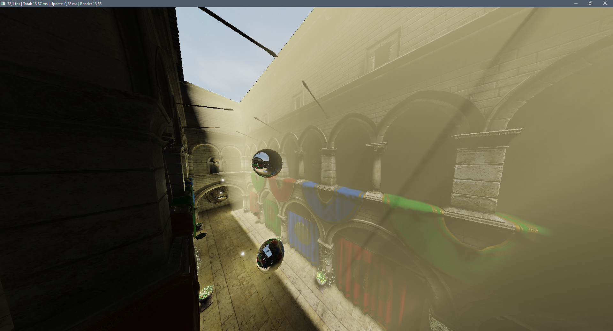
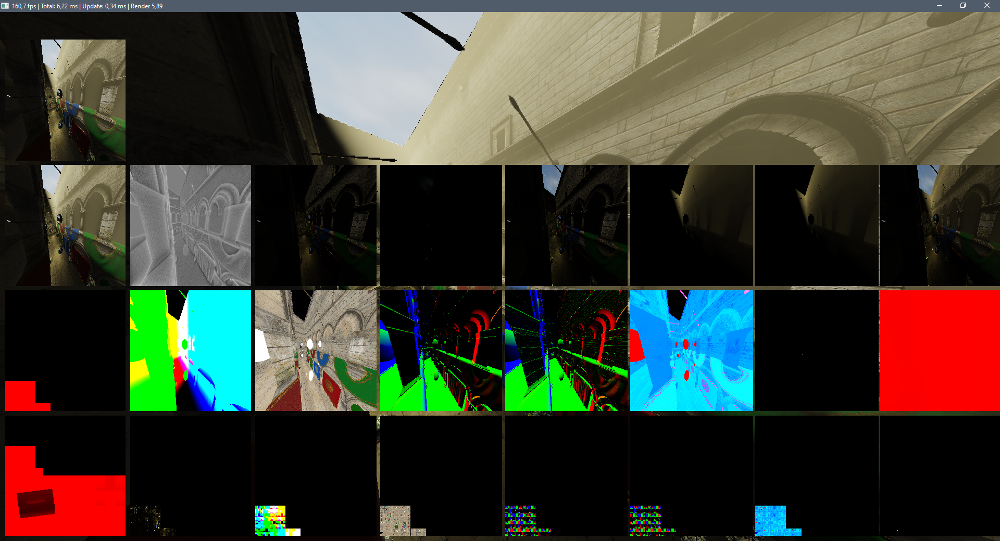
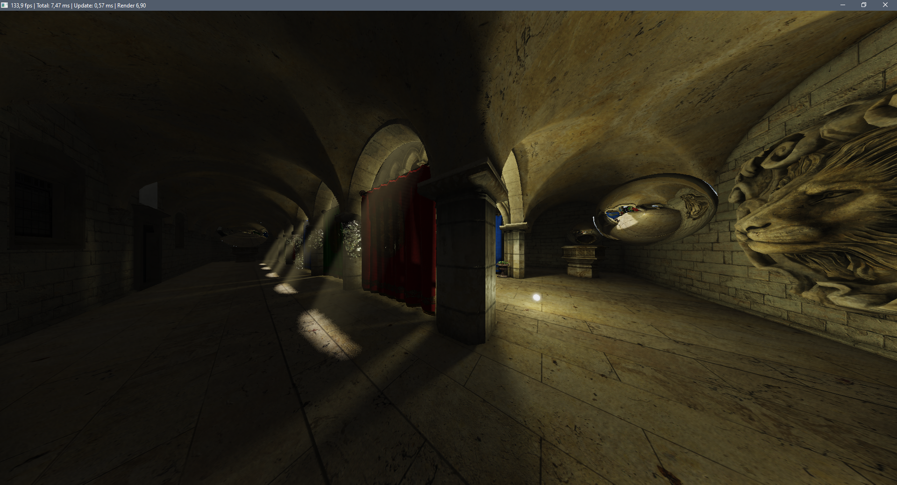

# C# openGL renderer
This is a real-time C# openGL render project made with [OpenTK](https://github.com/opentk/opentk) and [Default ECS](https://github.com/Doraku/DefaultEcs). Which has been created  for the master lecture "Advanced computer graphics" ([rwu.de](https://www.rwu.de/)).

## Implemented features
- CPU
    - openGL object abstraction
    - GLTF to ECS converted
    - Scene managed with ECS
    - Hierarchy between entities
- GPU
    - Shadows
        - Direct, Point, Spot
        - Single shadow map for all light sources
        - PCF
    - Dynamic reflection probs
        - Realtime or first frame creation
        - Also with shadow mapping
    - Forward rendering
    - Deferred rendering
    - Postprocessing:
        - Ambient occlusion
        - Bloom
        - Volumetric lights
        - ACES Tonemapping

Some more pictures:

